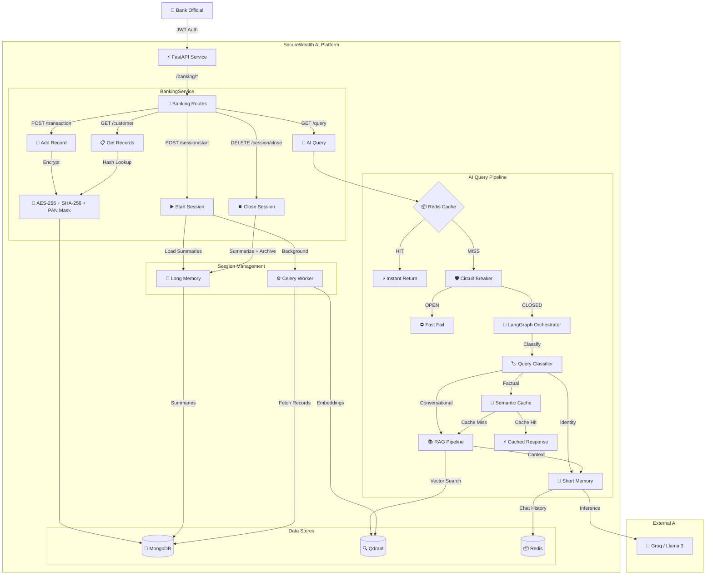
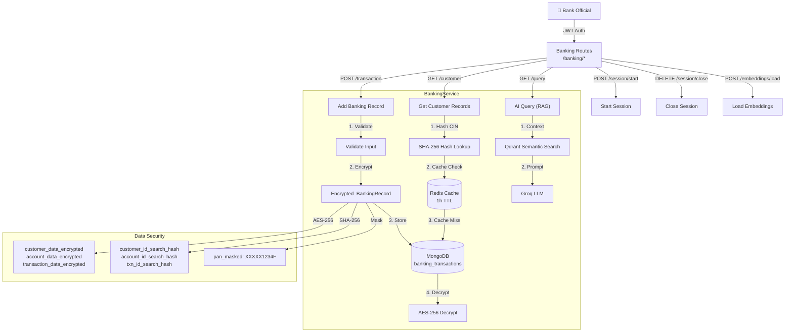
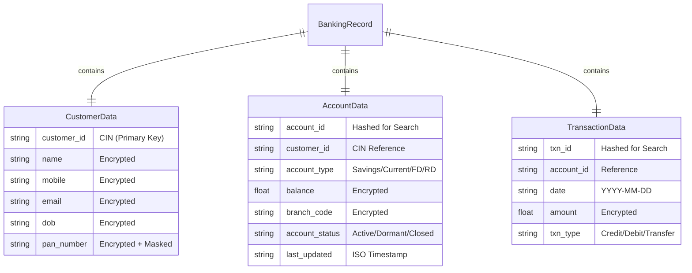
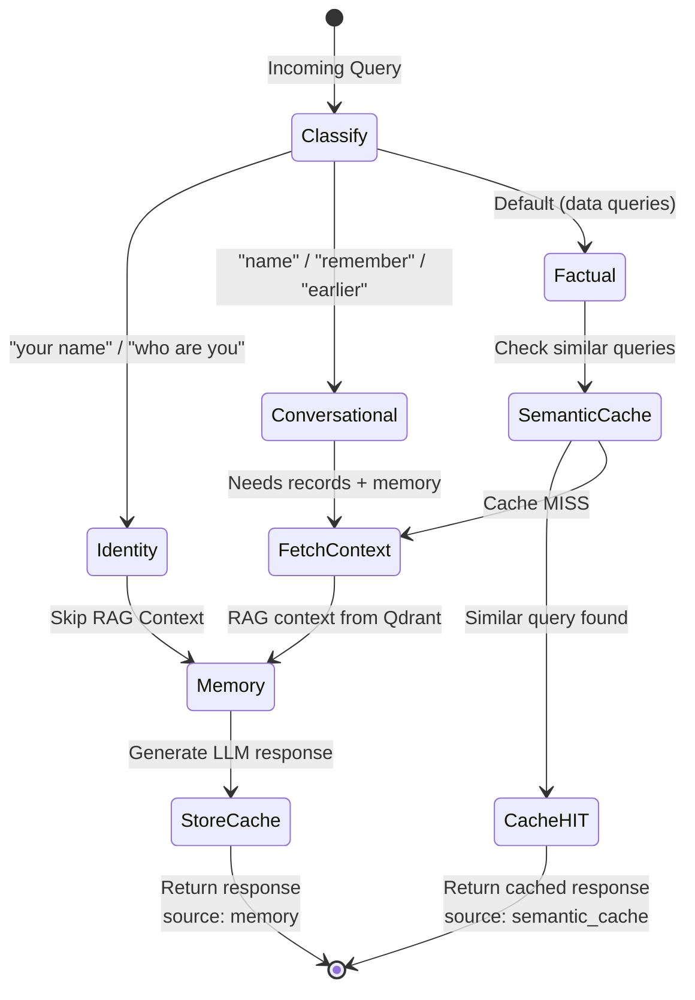
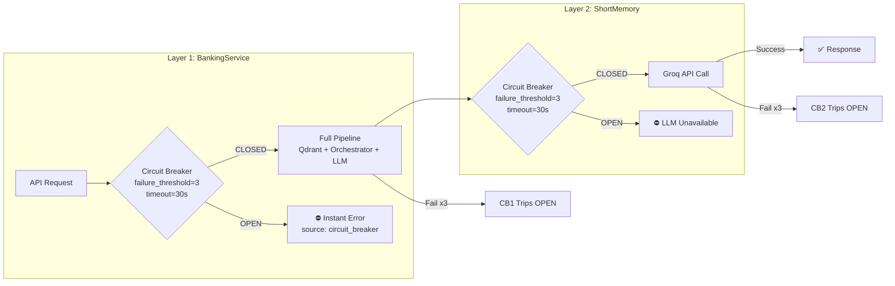

# SecureWealth AI 🏦🤖

**SecureWealth AI** is an advanced, AI-powered assistant service designed for **banking professionals**. It leverages **Retrieval-Augmented Generation (RAG)** with a **LangGraph orchestrator** to provide accurate, context-aware responses based on customer financial data — accounts, transactions, and banking records.

Built with **FastAPI**, **Celery**, **Qdrant**, and **LangGraph**, this service ensures high performance, security, and scalability for production banking environments.

---

## 🚀 Key Features

*   **🔒 Secure & Private (Financial Compliance Design)**:
    *   **AES-256 Encryption**: All sensitive data (customer financial records, account details) is encrypted at rest using Fernet (AES-128-CBC + HMAC-SHA256).
    *   **PAN Masking**: PAN numbers are encrypted AND masked (XXXXX1234F) — dual protection for regulatory compliance.
    *   **Encrypted Chat History**: Both Redis (short-term) and MongoDB (long-term) message stores are encrypted.
    *   **Anonymized Search**: Identifiers (CIN, customer_id, account_id) are hashed with PBKDF2-SHA256 for secure lookups — raw PII never stored in cache keys or logs.
    *   **Role-Based Access**: Strict JWT authentication via dependency injection for bank officials.
    *   **Input Sanitization**: Security middleware validates all inputs against XSS, SQL injection, path traversal, and code injection patterns.

*   **⚡ High-Performance Architecture**:
    *   **Asynchronous Processing**: Heavy tasks like embedding generation are offloaded to **Celery** workers with idempotency guards.
    *   **Hybrid Search**: Combines **Qdrant** (Vector Search) with MongoDB legacy metadata lookups for maximum recall.
    *   **Multi-Layer Caching**:
        *   **Redis**: Read-through cache for records (1h TTL) and query results.
        *   **Semantic Cache**: RedisVL-powered vector similarity cache for LLM response reuse.
    *   **LangGraph Query Routing**: Intelligent state machine classifies queries as identity, conversational, or factual — routes to cache or RAG accordingly.

*   **🛡️ Robust & Resilient**:
    *   **Circuit Breakers**: Implemented for **Redis**, **Qdrant**, and **LLM** calls to prevent cascading failures.
    *   **Graceful Shutdown**: Background monitoring tasks are cleanly cancelled on service exit.
    *   **Health Monitoring**: Comprehensive `/health` endpoint checking DB, Redis, and Qdrant connectivity.
    *   **Rate Limiting**: IP-based request throttling (configurable window and limit).

*   **🧠 Intelligent Insights**:
    *   **Groq (Llama 3)**: Ultra-fast inference for generating financially relevant summaries and answers.
    *   **Semantic Understanding**: Finds records based on meaning (e.g., "large withdrawals") even if exact keywords mismatch.
    *   **Session Memory**: Multi-turn conversations backed by short-term (Redis) and long-term (MongoDB) memory with LLM-generated session summaries.

---

## 🛠️ Technology Stack

| Category | Technology |
| :--- | :--- |
| **Framework** | FastAPI (Python 3.10+) |
| **Task Queue** | Celery (Redis Broker + Backend) |
| **Vector Database** | Qdrant (Cosine Similarity, 384-dim) |
| **Cache** | Redis Stack (Async + Sync + RediSearch) |
| **Database** | MongoDB (Motor async + PyMongo sync) |
| **LLM Engine** | Groq — Llama 3 (via LangChain) |
| **Embeddings** | Sentence-Transformers (`all-MiniLM-L6-v2`) |
| **Orchestrator** | LangGraph (State Machine for query routing) |
| **Semantic Cache** | RedisVL (Vector similarity search) |
| **Encryption** | Fernet (AES-128-CBC + HMAC-SHA256) |
| **Logging** | AI-Watchman (Centralized log aggregation) |
| **CI/CD** | GitHub Actions → AWS ECR |
| **Container** | Docker + Docker Compose |

---

## 🏗️ System Architecture

### Overall Architecture



### Banking Module Architecture



### Banking Data Model



### LangGraph Orchestrator — Query Routing Engine



### Memory Architecture — Short-Term & Long-Term

```mermaid
graph TD
    subgraph "Session Lifecycle"
        Start["POST /session/start"] --> LoadLong["Load Long Memory<br/>(Previous Summaries)"]
        LoadLong --> InitShort["Initialize Short Memory<br/>(Redis Chat History)"]
        InitShort --> CeleryTask["Celery: Load Embeddings<br/>(Background)"]
    end

    subgraph "Query Flow (During Session)"
        Query["GET /query"] --> RedisCache{"Redis Cache<br/>(Exact Match)"}
        RedisCache -->|"HIT"| InstantReturn["⚡ Instant Return"]
        RedisCache -->|"MISS"| CB1{"🛡️ Circuit Breaker L1<br/>(BankingService)"}
        CB1 -->|"OPEN"| FastFail["❌ Fast Fail<br/>'Retry in 30s'"]
        CB1 -->|"CLOSED"| Orchestrator["LangGraph Orchestrator"]
        Orchestrator --> Classify["Classify Query"]
        Classify --> SemanticCache{"Semantic Cache<br/>(Vector Similarity)"}
        SemanticCache -->|"HIT"| CachedResponse["Return Cached"]
        SemanticCache -->|"MISS"| Qdrant["Qdrant Vector Search"]
        Qdrant --> ShortMemory["Short Memory<br/>(LangChain + History)"]
        ShortMemory --> CB2{"🛡️ Circuit Breaker L2<br/>(ShortMemory)"}
        CB2 -->|"OPEN"| LLMFail["❌ LLM Unavailable"]
        CB2 -->|"CLOSED"| Groq["🧠 Groq LLM"]
        Groq --> Response["✅ AI Response"]
        Response --> CacheStore["Store in Redis + Semantic Cache"]
    end

    subgraph "Session Close"
        Close["DELETE /session/close"] --> Summarize["LLM: Generate Summary"]
        Summarize --> ArchiveLong["Archive to Long Memory<br/>(MongoDB Encrypted)"]
        ArchiveLong --> ClearShort["Clear Short Memory<br/>(Redis)"]
        ClearShort --> OptionalDelete["Optional: Delete Embeddings<br/>(Qdrant)"]
    end
```



### Circuit Breaker — Dual Layer Protection



---

## 📋 Prerequisites

Before running the application, ensure you have:

*   **Python 3.10+**
*   **Docker & Docker Compose** (for Qdrant & Redis Stack)
*   **Redis Stack** (Local or Cloud — requires RediSearch module for Semantic Cache)
*   **MongoDB Connection** (Atlas or Local)
*   **Groq API Key** ([console.groq.com](https://console.groq.com))

---

## ⚙️ Installation & Setup

### 1. Clone the Repository
```bash
git clone <repository_url>
cd secure_wealth_ai
```

### 2. Create Virtual Environment
```bash
python -m venv venv
source venv/bin/activate  # On Windows: venv\Scripts\activate
```

### 3. Install Dependencies
```bash
pip install -r requirements.txt
```

### 4. Configure Environment Variables
Create a `.env` file in the root directory:

```env
# ===========================================
# SECURITY CONFIGURATION (REQUIRED)
# ===========================================
JWT_SECRET=your_jwt_secret_key
JWT_ALGORITHM=HS256
ENCRYPTION_KEY=your_fernet_base64_key      # Generate with: python -c "from cryptography.fernet import Fernet; print(Fernet.generate_key().decode())"
EMAIL_SALT=your_email_salt
HASH_SALT=your_hash_salt

# ===========================================
# DATABASE CONFIGURATION
# ===========================================
MONGO_URL=mongodb+srv://<user>:<password>@cluster.mongodb.net
REDIS_HOST=localhost
REDIS_PORT=6379
QDRANT_HOST=localhost
QDRANT_PORT=6333

# ===========================================
# AI & MODEL
# ===========================================
GROQ_API_KEY=gsk_...

# ===========================================
# AUTHENTICATION
# ===========================================
AUTH_URL=http://localhost:8001             # Auth service URL for OAuth2 token endpoints

# ===========================================
# ENVIRONMENT
# ===========================================
ENVIRONMENT=development                    # Set to "development" to enable /docs, /scalar, /openapi.json

# ===========================================
# MONITORING (Optional)
# ===========================================
Account_id=your_watchman_account_id
Access_token=your_watchman_access_token
```

---

## 🚀 Running the Application

### Option A: Docker Compose (Recommended)

#### Development (Infrastructure Only)
Start Qdrant and Redis Stack:
```bash
docker-compose -f compose.yml up -d
```

Then run the API and Celery locally:
```bash
# Terminal 1: API Server
uvicorn app:app --host 0.0.0.0 --port 8000 --reload

# Terminal 2: Celery Worker
python start_celery.py
```

#### Production (Full Stack)
Start all services (API + Celery + Qdrant):
```bash
docker-compose -f docker-compose.full.yml up -d
```

### Option B: Manual Setup

#### 1. Start Infrastructure
```bash
# Start Redis Stack (includes RediSearch for Semantic Cache)
docker run -d --name redis-stack -p 6379:6379 -p 8001:8001 redis/redis-stack:latest

# Start Qdrant
docker run -d --name qdrant -p 6333:6333 -p 6334:6334 qdrant/qdrant:latest
```

#### 2. Start the API Server
```bash
uvicorn app:app --host 0.0.0.0 --port 8000 --reload
```

#### 3. Start the Celery Worker
```bash
python start_celery.py
```

### Access Points (Development Mode)
| Resource | URL |
| :--- | :--- |
| **Swagger UI** | `http://localhost:8000/docs` |
| **Scalar Docs** | `http://localhost:8000/scalar` |
| **ReDoc** | `http://localhost:8000/redoc` |
| **OpenAPI JSON** | `http://localhost:8000/openapi.json` |
| **RedisInsight** | `http://localhost:8001` |

> **Note:** API documentation endpoints are only available when `ENVIRONMENT=development`.

---

## 📡 API Endpoints

### 🏦 Banking (SecureWealth AI)

| Method | Endpoint | Auth | Description |
| :--- | :--- | :---: | :--- |
| `GET` | `/health` | ❌ | System health check (DB, Redis, Qdrant) |
| `GET` | `/banking/health` | ❌ | Banking route health check |
| `GET` | `/banking/ready` | ❌ | Banking readiness check |
| `POST` | `/banking/transaction` | 🔐 Official | Add banking record (customer + account + transaction) |
| `GET` | `/banking/customer` | 🔐 Official | Get all decrypted records for a customer |
| `GET` | `/banking/query` | 🔐 Official | AI-powered RAG query on banking records |
| `POST` | `/banking/session/start` | 🔐 Official | Start customer session (load embeddings + memory) |
| `DELETE` | `/banking/session/close` | 🔐 Official | Close session (archive + optionally delete embeddings) |
| `POST` | `/banking/embeddings/load` | 🔐 Official | Trigger background embedding generation |
| `POST` | `/banking/embeddings/search` | 🔐 Official | Semantic search on banking records |
| `DELETE` | `/banking/embeddings/delete` | 🔐 Official | Delete customer embeddings from Qdrant |

> 🔐 **Auth**: Requires `Authorization: Bearer <jwt_token>` header.

For detailed API documentation, see [`api-spec.yaml`](./api-spec.yaml) and [`API_DOCUMENTATION.md`](./API_DOCUMENTATION.md).

---

## 📂 Project Structure

```
secure_wealth_ai/
├── app.py                          # FastAPI application entry point
├── start_celery.py                 # Celery worker entry point
├── requirements.txt                # Python dependencies
├── Dockerfile                      # API service Docker image
├── compose.yml                     # Dev infrastructure (Redis Stack + Qdrant)
├── docker-compose.full.yml         # Full stack (API + Celery + Qdrant)
├── api-spec.yaml                   # OpenAPI 3.0 specification
├── API_DOCUMENTATION.md            # Detailed API documentation
├── .env                            # Environment variables (not committed)
├── .env.docker                     # Docker-specific environment variables
│
├── curabot/                            # Core application module
│   ├── config/                     # Configuration modules
│   │   ├── database.py             # MongoDB & Redis & Qdrant connection settings
│   │   ├── redis.py                # Redis async/sync client & health monitoring
│   │   ├── qdrant.py               # Qdrant Vector DB client & collection management
│   │   ├── model.py                # LLM model configuration (Banking prompts)
│   │   ├── worker.py               # Celery app configuration & task signals
│   │   ├── security_config.py      # Security settings (CORS, rate limits, JWT)
│   │   ├── semantic_cache.py       # RedisVL semantic cache for LLM responses
│   │   ├── bloom.py                # Bloom filter for probabilistic lookups
│   │   └── secert.py               # Secret key management
│   │
│   ├── routes/                     # API route handlers
│   │   └── banking.py              # Banking /banking/* endpoints
│   │
│   ├── services/                   # Business logic layer
│   │   ├── banking.py              # Banking RAG orchestrator + session management
│   │   └── embeddings.py           # Vector embedding CRUD
│   │
│   ├── memory/                     # Conversational memory system
│   │   ├── short_memory.py         # Redis-backed encrypted chat history (24h TTL)
│   │   ├── long_memory.py          # MongoDB-backed encrypted session summaries
│   │   └── orchestrator.py         # LangGraph state machine for query routing
│   │
│   ├── model/                      # Pydantic data models
│   │   ├── banking_model.py        # Banking request/response schemas (Customer, Account, Transaction)
│   │   └── banking_encrypted_model.py  # Encrypted banking models (AES + SHA-256 + PAN masking)
│   │
│   ├── security/                   # Security & encryption
│   │   ├── encryption.py           # AES-256 encryption + PBKDF2 hashing (shared)
│   │   ├── cache_encryption.py     # Redis cache encryption utilities
│   │   ├── encrypted_history.py    # Encrypted Redis chat message history
│   │   └── encrypted_mongo_history.py  # Encrypted MongoDB chat message history
│   │
│   ├── middleware/                  # HTTP middleware
│   │   └── security.py             # Rate limiting, input validation, security headers
│   │
│   ├── core/                       # Core utilities
│   │   ├── circuit_breaker.py      # Circuit breaker pattern implementation
│   │   └── security.py             # OAuth2 scheme definitions
│   │
│   ├── Dependency/                 # FastAPI dependency injection
│   │   └── dependency.py           # OfficialDep (bank official auth), CustomerDep
│   │
│   ├── helper/                     # Utility functions
│   │   └── utils.py                # JWT decoding, MongoDB serialization
│   │
│   ├── logger/                     # Logging
│   │   └── log.py                  # AI-Watchman integration
│   │
│   └── data/                       # Persistent data
│       └── bloom/                  # Bloom filter data files
│
├── celery_docker/                  # Celery Docker configuration
│   └── Dockerfile                  # Celery worker Docker image
│
└── .github/
    └── workflows/
        └── main.yaml               # CI/CD: Build & push to AWS ECR
```

---

## 🏦 Banking Module — Details

### Data Models

| Model | Fields | Storage |
| :--- | :--- | :--- |
| **CustomerData** | `customer_id` (CIN), `name`, `mobile`, `email`, `dob`, `pan_number` | Encrypted (AES-256), PAN masked |
| **AccountData** | `account_id`, `customer_id`, `account_type`, `balance`, `branch_code`, `account_status`, `last_updated` | Encrypted (AES-256) |
| **TransactionData** | `txn_id`, `account_id`, `date`, `amount`, `txn_type` | Encrypted (AES-256) |

### Encryption Strategy

| Field Type | Encryption Method | Purpose |
| :--- | :--- | :--- |
| **Data blobs** (customer, account, txn) | AES-256 (Fernet) | Confidentiality at rest |
| **Search keys** (customer_id, account_id, txn_id) | SHA-256 (PBKDF2) | Deterministic hash for lookups without exposing raw values |
| **PAN number** | AES-256 + Masking | Dual protection: encrypted for storage, masked (XXXXX1234F) for display |

### Session Workflow

```
1. POST /banking/session/start     → Load embeddings + long memory → Redis
2. GET  /banking/query             → RAG pipeline → AI response
3. GET  /banking/query             → Follow-up questions (conversational)
4. DELETE /banking/session/close   → Summarize → Archive → Clean up
```

### MongoDB Collections

| Collection | Database | Purpose |
| :--- | :--- | :--- |
| `banking_transactions` | `banking_records` | Banking records (encrypted) |
| `officials` | `auth` | Bank official authentication |
| `customers` | `auth` | Customer records |

---

## 🛡️ Security Design

### Authentication & Authorization
1.  **JWT-Based Auth**: Bank official tokens validated via OAuth2 Bearer scheme.
2.  **Token Blacklisting**: JTI-based blacklist check via Redis prevents reuse of revoked tokens.
3.  **Hybrid User Lookup**: Supports both hashed CIN and legacy plaintext lookups during migration.

### Data Protection
1.  **Strict Isolation**: Embeddings and searches are strictly filtered by CIN. A bank official querying Customer A cannot semantically retrieve records from Customer B.
2.  **Encrypted At Rest**: All records, chat history, and session data are encrypted using Fernet before storage.
3.  **Hashed Identifiers**: All PII (CIN, email, PAN) is hashed with PBKDF2 before use in cache keys, logs, and database lookups.
4.  **PAN Dual Protection**: PAN numbers are both encrypted (for secure storage) and masked (for safe display).

### Request Security
1.  **Security Middleware**: Validates all inputs against XSS, SQL injection, path traversal, and code injection patterns.
2.  **Rate Limiting**: IP-based throttling (100 requests/hour default) with configurable window.
3.  **Security Headers**: HSTS, CSP, X-Frame-Options, and CORS enforcement on all responses.
4.  **Circuit Breakers**: External calls are guarded — if Qdrant/LLM fails, the service gracefully degrades with 503.

---

## 🔄 CI/CD Pipeline

Automated via GitHub Actions (`.github/workflows/main.yaml`):

1.  **Trigger**: Push or PR to `main` branch
2.  **Build API Image**: Builds Docker image from `./Dockerfile` → pushes to AWS ECR (`securewealth_ai`)
3.  **Build Celery Image**: Builds Docker image from `./celery_docker/Dockerfile` → pushes to AWS ECR (`celery`)

Both images are tagged with `latest` and the GitHub run number for versioning.

---

## 👨‍💻 Monitoring

*   **Logs**: Structured JSON logs sent to [AI-Watchman](https://watchman.securewealth.in) dashboard.
*   **Health**: Query `/health` to verify component connectivity (MongoDB, Redis, Qdrant).
*   **Celery Tasks**: Monitor via Celery signals — task start, completion, and failure events are logged.
*   **RedisInsight**: GUI at `http://localhost:8001` for cache inspection (dev mode).

---

## 📄 License

Proprietary — SecureWealth Team. All rights reserved.

---

**Maintained by SecureWealth Team**
