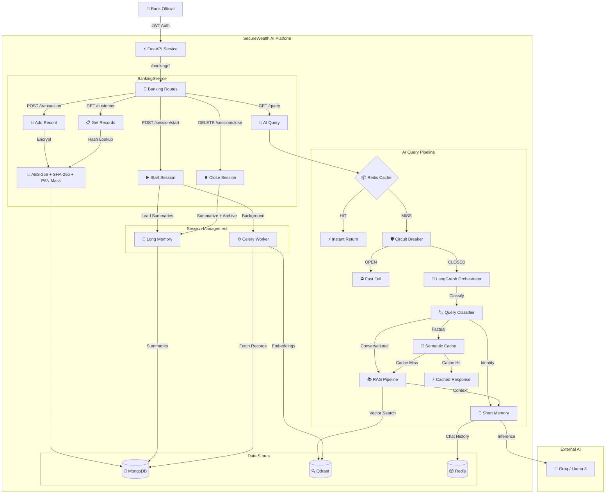
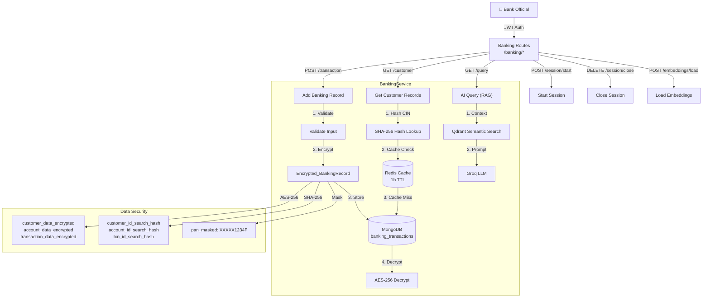
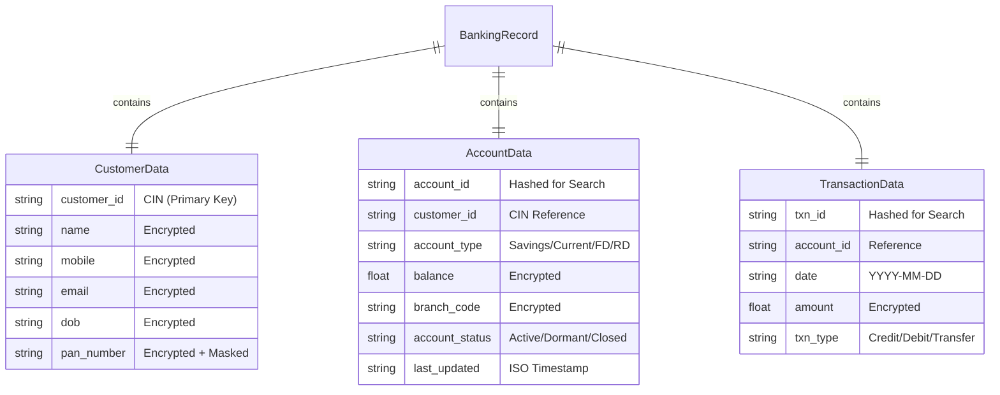
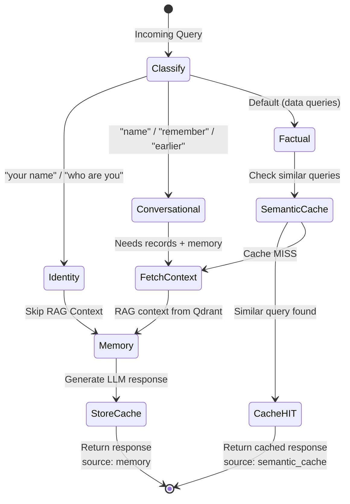
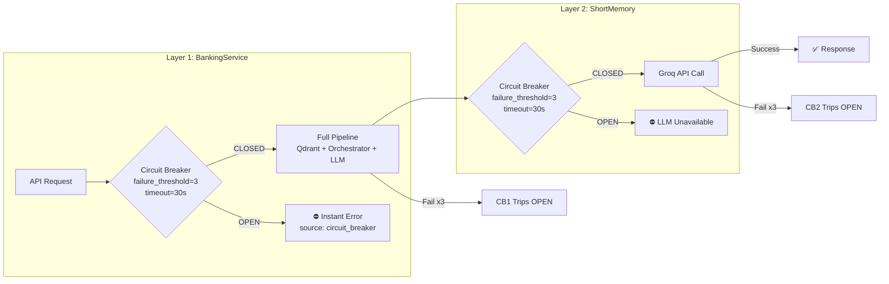

# NTCC MINOR 

**SecureWealth AI** is an advanced, AI-powered assistant service designed for **banking professionals**. It leverages **Retrieval-Augmented Generation (RAG)** with a **LangGraph orchestrator** to provide accurate, context-aware responses based on customer financial data — accounts, transactions, and banking records.

Built with **FastAPI**, **Celery**, **Qdrant**, and **LangGraph**, this service ensures high performance, security, and scalability for production banking environments.

---

## 🚀 Key Features

*   **🔒 Secure & Private (Financial Compliance Design)**:
    *   **AES-256 Encryption**: All sensitive data (customer financial records, account details) is encrypted at rest using Fernet (AES-128-CBC + HMAC-SHA256).
    *   **PAN Masking**: PAN numbers are encrypted AND masked (XXXXX1234F) — dual protection for regulatory compliance.
    *   **Encrypted Chat History**: Both Redis (short-term) and MongoDB (long-term) message stores are encrypted.
    *   **Anonymized Search**: Identifiers (CIN, customer_id, account_id) are hashed with PBKDF2-SHA256 for secure lookups — raw PII never stored in cache keys or logs.
    *   **Role-Based Access**: Strict JWT authentication via dependency injection for bank officials.
    *   **Input Sanitization**: Security middleware validates all inputs against XSS, SQL injection, path traversal, and code injection patterns.

*   **⚡ High-Performance Architecture**:
    *   **Asynchronous Processing**: Heavy tasks like embedding generation are offloaded to **Celery** workers with idempotency guards.
    *   **Hybrid Search**: Combines **Qdrant** (Vector Search) with MongoDB legacy metadata lookups for maximum recall.
    *   **Multi-Layer Caching**:
        *   **Redis**: Read-through cache for records (1h TTL) and query results.
        *   **Semantic Cache**: RedisVL-powered vector similarity cache for LLM response reuse.
    *   **LangGraph Query Routing**: Intelligent state machine classifies queries as identity, conversational, or factual — routes to cache or RAG accordingly.

*   **🛡️ Robust & Resilient**:
    *   **Circuit Breakers**: Implemented for **Redis**, **Qdrant**, and **LLM** calls to prevent cascading failures.
    *   **Graceful Shutdown**: Background monitoring tasks are cleanly cancelled on service exit.
    *   **Health Monitoring**: Comprehensive `/health` endpoint checking DB, Redis, and Qdrant connectivity.
    *   **Rate Limiting**: IP-based request throttling (configurable window and limit).

*   **🧠 Intelligent Insights**:
    *   **Groq (Llama 3)**: Ultra-fast inference for generating financially relevant summaries and answers.
    *   **Semantic Understanding**: Finds records based on meaning (e.g., "large withdrawals") even if exact keywords mismatch.
    *   **Session Memory**: Multi-turn conversations backed by short-term (Redis) and long-term (MongoDB) memory with LLM-generated session summaries.

---

## 🛠️ Technology Stack

| Category | Technology |
| :--- | :--- |
| **Framework** | FastAPI (Python 3.10+) |
| **Task Queue** | Celery (Redis Broker + Backend) |
| **Vector Database** | Qdrant (Cosine Similarity, 384-dim) |
| **Cache** | Redis Stack (Async + Sync + RediSearch) |
| **Database** | MongoDB (Motor async + PyMongo sync) |
| **LLM Engine** | Groq — Llama 3 (via LangChain) |
| **Embeddings** | Sentence-Transformers (`all-MiniLM-L6-v2`) |
| **Orchestrator** | LangGraph (State Machine for query routing) |
| **Semantic Cache** | RedisVL (Vector similarity search) |
| **Encryption** | Fernet (AES-128-CBC + HMAC-SHA256) |
| **Logging** | AI-Watchman (Centralized log aggregation) |
| **CI/CD** | GitHub Actions → AWS ECR |
| **Container** | Docker + Docker Compose |

---

## 🏗️ System Architecture

### Overall Architecture

### Banking Module Architecture

### Banking Data Model

### LangGraph Orchestrator — Query Routing Engine

### Memory Architecture — Short-Term & Long-Term

```mermaid
graph TD
    subgraph "Session Lifecycle"
        Start["POST /session/start"] --> LoadLong["Load Long Memory<br/>(Previous Summaries)"]
        LoadLong --> InitShort["Initialize Short Memory<br/>(Redis Chat History)"]
        InitShort --> CeleryTask["Celery: Load Embeddings<br/>(Background)"]
    end

    subgraph "Query Flow (During Session)"
        Query["GET /query"] --> RedisCache{"Redis Cache<br/>(Exact Match)"}
        RedisCache -->|"HIT"| InstantReturn["⚡ Instant Return"]
        RedisCache -->|"MISS"| CB1{"🛡️ Circuit Breaker L1<br/>(BankingService)"}
        CB1 -->|"OPEN"| FastFail["❌ Fast Fail<br/>'Retry in 30s'"]
        CB1 -->|"CLOSED"| Orchestrator["LangGraph Orchestrator"]
        Orchestrator --> Classify["Classify Query"]
        Classify --> SemanticCache{"Semantic Cache<br/>(Vector Similarity)"}
        SemanticCache -->|"HIT"| CachedResponse["Return Cached"]
        SemanticCache -->|"MISS"| Qdrant["Qdrant Vector Search"]
        Qdrant --> ShortMemory["Short Memory<br/>(LangChain + History)"]
        ShortMemory --> CB2{"🛡️ Circuit Breaker L2<br/>(ShortMemory)"}
        CB2 -->|"OPEN"| LLMFail["❌ LLM Unavailable"]
        CB2 -->|"CLOSED"| Groq["🧠 Groq LLM"]
        Groq --> Response["✅ AI Response"]
        Response --> CacheStore["Store in Redis + Semantic Cache"]
    end

    subgraph "Session Close"
        Close["DELETE /session/close"] --> Summarize["LLM: Generate Summary"]
        Summarize --> ArchiveLong["Archive to Long Memory<br/>(MongoDB Encrypted)"]
        ArchiveLong --> ClearShort["Clear Short Memory<br/>(Redis)"]
        ClearShort --> OptionalDelete["Optional: Delete Embeddings<br/>(Qdrant)"]
    end
```

### Circuit Breaker — Dual Layer Protection

---

## 📋 Prerequisites

Before running the application, ensure you have:

*   **Python 3.10+**
*   **Docker & Docker Compose** (for Qdrant & Redis Stack)
*   **Redis Stack** (Local or Cloud — requires RediSearch module for Semantic Cache)
*   **MongoDB Connection** (Atlas or Local)
*   **Groq API Key** ([console.groq.com](https://console.groq.com))

